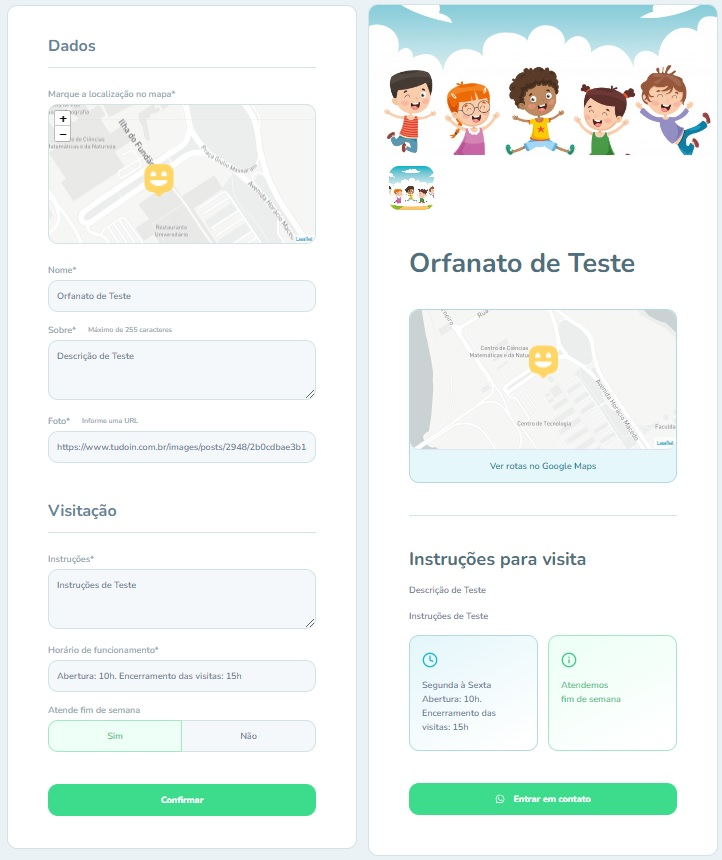

    
    
     
     
    

## 🚀 Tecnologias

- [SpringBoot](https://spring.io/projects/spring-boot/)
- [ReactJS](https://reactjs.org)
- [PostgreSQL](https://www.postgresql.org/)
- [MapBox](https://www.mapbox.com/)

## 💻 Sobre

- Happy é uma plataforma que indica a localização de orfanatos com o auxílio de mapas.

## 🔖 Layout

- [Layout Web](https://www.figma.com/file/JrKEg4UvgDLUE21qWZECYM/Happy-Web)

## ⚡ Instalação
- Antes de iniciar o projeto reactjs, configure o uso dos mapas:
    - Crie uma conta no site [mapbox](https://www.mapbox.com/).
    - Faça login e na sua [página de usuário](https://account.mapbox.com/) copie a "Default public token".
    - Na pasta do reactjs, renomeie o arquivo .env_example para .env.
    - No arquivo .env, em: "REACT_APP_MAPBOX_TOKEN=", informe o seu "Default public token".
- Em springboot/src/main/application.properties informe as conexões do seu banco de dados.
- Inicie o projeto springboot.
- Inicie o projeto reactjs.
